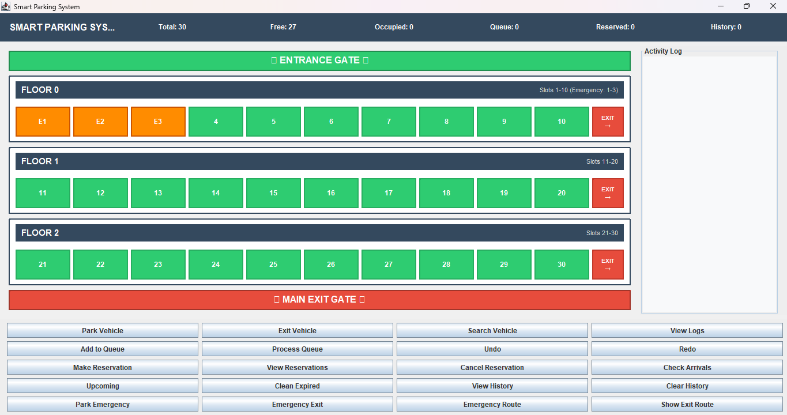

# 🚗 Smart Parking System

## 📝 Description

Smart Parking System is a **Java Swing GUI application** designed to manage parking spaces efficiently in a multi-floor parking area.
The system tracks available parking slots, manages vehicle entry and exit, and finds the **shortest path to the nearest exit using Dijkstra's Algorithm**.

It includes features like a real-time dashboard, emergency parking support, reservation system, and visual exit gates on each floor.

---

## 🚀 System Features

### 🅿️ Parking Management

* Multi-floor parking system (3 floors × 10 slots)
* Real-time parking slot status
* Automatic slot allocation
* Vehicle entry and exit tracking
* Emergency parking priority (Floor 0: Slots 1–3)

### 🗺️ Exit Route Optimization

* Shortest exit route using **Dijkstra’s Algorithm**
* Exit gates available on every floor
* Route dialog showing distance and estimated time
* Emergency priority exit routes

### 📊 Dashboard & Tools

* Live statistics: Total / Free / Occupied / Queue / Reserved
* Reservation system with time-based processing
* Undo and Redo command history
* Activity logging system

---

## 🛠 Tech Stack

| Technology       | Usage                                      |
| ---------------- | ------------------------------------------ |
| Java 17+         | Core logic and object-oriented programming |
| Java Swing       | GUI interface                              |
| Maven            | Project management and build tool          |
| Graph Algorithms | Dijkstra’s shortest path                   |
| Apache NetBeans  | Development IDE                            |

---

## 📂 Project Structure

```
src/
 ├── main
 │   └── java
 │       ├── com.mycompany.parkinglotmanager
 │       │   └── ParkingLotManager.java
 │       │
 │       ├── graphs
 │       │   └── ParkingGraph.java
 │       │
 │       ├── gui
 │       │   └── MainFrame.java
 │       │
 │       ├── managers
 │       │   ├── ParkingManager.java
 │       │   ├── ParkingLog.java
 │       │   └── OperationHistory.java
 │       │
 │       ├── models
 │       │   ├── ParkingSlot.java
 │       │   ├── Vehicle.java
 │       │   ├── Reservation.java
 │       │   └── SlotType.java
 │       │
 │       └── trees
 │           ├── ReservationTree.java
 │           └── VehicleType.java
```

---

## ⚙️ How to Run the Project

### Method 1 – Using NetBeans
1. Clone the Repository

```bash
git clone https://github.com/Samruddhi2103/ParkingLotManager.git
```


2. Open the project in **Apache NetBeans**

3. Build the project
   Right Click Project → **Clean and Build**

4. Run the project
   Right Click **MainFrame.java** → **Run File**

---

### Method 2 – Using Maven Command

```
mvn clean compile exec:java -Dexec.mainClass="gui.MainFrame"
```

---

## 📸 Screenshots

### parking Dashboard



---

## 🎯 Learning Outcomes

Through this project I learned:

✔ Java Swing GUI development
✔ Implementation of graph algorithms (Dijkstra)
✔ Maven project structure and dependency management
✔ Advanced Object-Oriented Programming concepts
✔ Event-driven programming using ActionListeners
✔ Multi-floor parking system design and optimization

---

## 👩‍💻 Author

**Samruddhi Patil**
MCA Student
📍 Mumbai, Maharashtra

